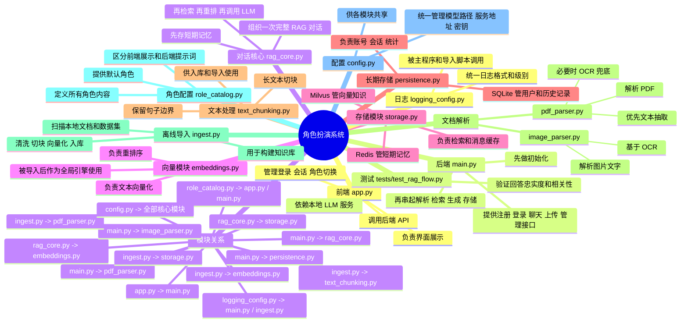
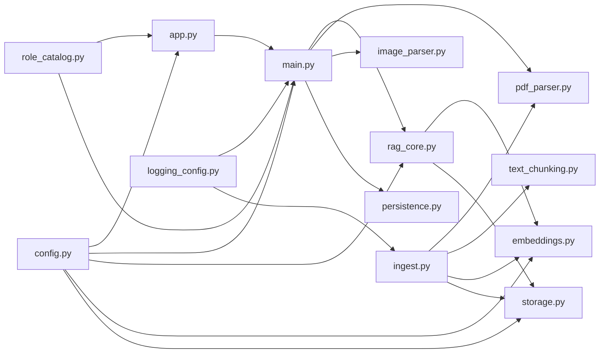

# 角色扮演系统思维导图

```mermaid
mindmap
  root((角色扮演系统))
    前端 app.py
      负责界面展示
      管理登录 会话 角色切换
      调用后端 API
    后端 main.py
      提供注册 登录 聊天 上传 管理接口
      先做初始化
      再串起解析 检索 生成 存储
    对话核心 rag_core.py
      组织一次完整 RAG 对话
      先存短期记忆
      再检索 再重排 再调用 LLM
    向量模块 embeddings.py
      负责文本向量化
      负责重排序
      被导入后作为全局引擎使用
    存储模块 storage.py
      Milvus 管向量知识
      Redis 管短期记忆
      负责检索和消息缓存
    长期存储 persistence.py
      SQLite 管用户和历史记录
      负责账号 会话 统计
    文本处理 text_chunking.py
      长文本切块
      保留句子边界
      供入库和导入使用
    文档解析
      pdf_parser.py
        解析 PDF
        优先文本抽取
        必要时 OCR 兜底
      image_parser.py
        解析图片文字
        基于 OCR
    离线导入 ingest.py
      扫描本地文档和数据集
      清洗 切块 向量化 入库
      用于构建知识库
    角色配置 role_catalog.py
      定义所有角色内容
      区分前端展示和后端提示词
      提供默认角色
    配置 config.py
      统一管理模型路径 服务地址 密钥
      供各模块共享
    日志 logging_config.py
      统一日志格式和级别
      被主程序和导入脚本调用
    测试 tests/test_rag_flow.py
      验证回答忠实度和相关性
      依赖本地 LLM 服务
    模块关系
      app.py -> main.py
      main.py -> rag_core.py
      rag_core.py -> embeddings.py
      rag_core.py -> storage.py
      main.py -> pdf_parser.py
      main.py -> image_parser.py
      main.py -> persistence.py
      ingest.py -> pdf_parser.py
      ingest.py -> text_chunking.py
      ingest.py -> embeddings.py
      ingest.py -> storage.py
      role_catalog.py -> app.py / main.py
      config.py -> 全部核心模块
      logging_config.py -> main.py / ingest.py
```

## 调用关系图

```mermaid
flowchart LR
    A[app.py] --> B[main.py]
    B --> C[rag_core.py]
    C --> D[embeddings.py]
    C --> E[storage.py]
    B --> F[pdf_parser.py]
    B --> G[image_parser.py]
    B --> H[persistence.py]
    I[ingest.py] --> F
    I --> J[text_chunking.py]
    I --> D
    I --> E
    K[role_catalog.py] --> A
    K --> B
    L[config.py] --> A
    L --> B
    L --> C
    L --> D
    L --> E
    M[logging_config.py] --> B
    M --> I
```
